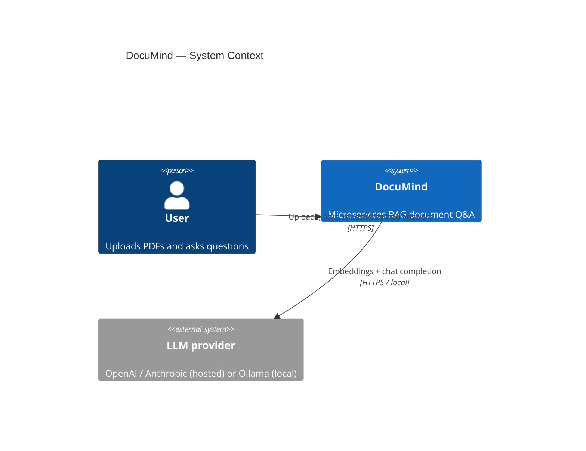
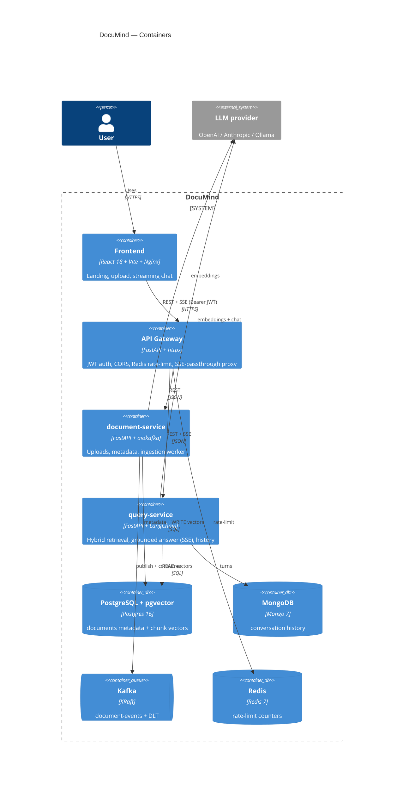
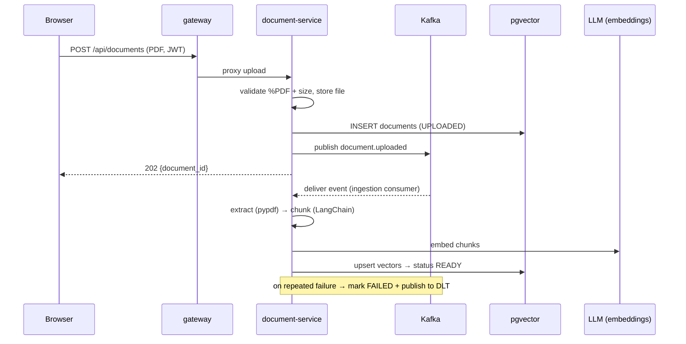
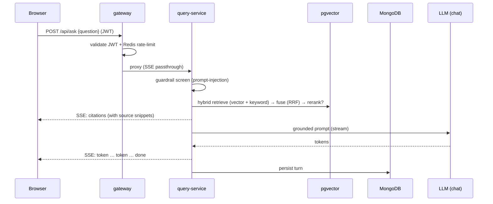

# DocuMind — High-Level Design (HLD)

> A complete, plain-English design of the whole system: every service, the data
> stores, the AI/RAG pipeline, the UI, and how it all runs. If you read one
> document, read this one. Diagrams render on GitHub (Mermaid).

**Contents**
1. [What DocuMind is](#1-what-documind-is)
2. [Goals & non-goals](#2-goals--non-goals)
3. [System context (C4 L1)](#3-system-context-c4-level-1)
4. [Container architecture (C4 L2)](#4-container-architecture-c4-level-2)
5. [Technology stack](#5-technology-stack)
6. [Services in detail](#6-services-in-detail)
7. [Shared libraries](#7-shared-libraries)
8. [Data stores](#8-data-stores)
9. [Key flows (sequence diagrams)](#9-key-flows)
10. [The AI / RAG pipeline](#10-the-ai--rag-pipeline)
11. [Provider switching (OpenAI / Anthropic / Ollama)](#11-provider-switching)
12. [Frontend / UI](#12-frontend--ui)
13. [Cross-cutting concerns](#13-cross-cutting-concerns)
14. [Deployment & operations](#14-deployment--operations)
15. [Testing strategy](#15-testing-strategy)
16. [Security](#16-security)
17. [Non-functional characteristics](#17-non-functional-characteristics)
18. [Roadmap (deliberately deferred)](#18-roadmap-deliberately-deferred)

---

## 1. What DocuMind is

DocuMind is a **document Q&A app**: you upload PDFs and ask natural-language
questions about them. It answers using **Retrieval-Augmented Generation (RAG)** —
it finds the most relevant passages in *your* documents and asks an LLM to answer
**only from those passages**, streaming the answer back with `[filename, chunk N]`
citations you can click to see the exact source.

It is built as **microservices** behind an API gateway, can run a fully **local,
free** model stack (Ollama) or hosted models (OpenAI/Anthropic), and ships with
evaluation, observability, and guardrails.

**One-paragraph mental model:** the browser talks only to the **gateway** (auth +
routing). Uploads go to **document-service**, which stores the file and drops a
message on **Kafka**; an ingestion worker inside that service turns the PDF into
embedded chunks in **pgvector**. Questions go to **query-service**, which retrieves
the best chunks, builds a grounded prompt, and **streams** the LLM's answer back.
Conversation history lives in **MongoDB**.

---

## 2. Goals & non-goals

**Goals**
- Accurate, **grounded** answers with citations (no hallucinations).
- **Microservices** with clear ownership, async messaging, and failure isolation.
- **Provider-flexible**: OpenAI, Anthropic, or 100% local/free (Ollama) — one switch.
- **Production signals**: evaluation, observability, guardrails, auth, CI, one-command run.
- A **premium, accessible UI**.

**Non-goals (for now)** — multi-tenant orgs, fine-tuning, OCR for scanned PDFs,
horizontal autoscaling in k8s. See [§18](#18-roadmap-deliberately-deferred).

---

## 3. System context (C4 Level 1)

---

## 4. Container architecture (C4 Level 2)

**Why this split:** the gateway concentrates cross-cutting concerns at the edge;
document-service and query-service can scale and fail independently; Kafka
decouples the slow ingestion work from the fast upload response. The one conscious
compromise — document-service and query-service **share the pgvector store** — is
documented in [ADR-0001](adr/0001-microservices-split.md).

---

## 5. Technology stack

| Layer | Technology | Why |
|---|---|---|
| Frontend | React 18, TypeScript, Vite | Typed, fast, modern SPA |
| UI system | Tailwind + shadcn/ui + Radix, Framer Motion, sonner, lucide | Own the components, accessible, animated |
| Server state | TanStack Query | Caching, polling, invalidation |
| Streaming | `fetch` + `ReadableStream` (SSE) | Token-by-token answers |
| API style | REST + Server-Sent Events | Simple, streamable |
| Services | FastAPI (Python 3.12), Pydantic v2, async | I/O-bound, async-first, typed |
| ORM / DB | SQLAlchemy 2.0 async + asyncpg | Async metadata access |
| Messaging | Apache Kafka (KRaft), aiokafka | Decoupled async ingestion + DLT |
| Vector store | pgvector via LangChain `PGVector` | Vectors in a boring transactional DB |
| Document store | MongoDB (Motor) | Append-only conversation history |
| Cache / limits | Redis | Shared rate-limit counters |
| RAG | LangChain (+ `langchain-ollama`/`-openai`) | Providers, splitter, prompt types |
| Auth | PyJWT + bcrypt | Stateless JWT at the edge |
| Eval | Ragas + retrieval metrics | "How good is the RAG?" |
| Observability | Langfuse, OpenTelemetry-style correlation id, structlog | Trace LLM calls + requests |
| Packaging | Docker, docker-compose, Nginx | One-command run |
| CI | GitHub Actions | Lint + tests on every push |

---

## 6. Services in detail

### 6.1 gateway (`services/gateway`)
The **only public entry point**.

- **Responsibility:** JWT auth (login + per-request validation), CORS, Redis-backed
  rate limiting on the expensive `POST /api/ask`, and a **streaming reverse proxy**
  to the internal services that passes SSE through unbuffered.
- **Key detail:** a naive proxy buffers the whole response and breaks token
  streaming; ours opens the upstream in streaming mode (`httpx … aiter_raw()`).
- **Owns:** a tiny `users` table (bcrypt-hashed) in Postgres; seeds a demo user.
- **API:**

  | Method | Path | Auth | Routed to |
  |---|---|---|---|
  | POST | `/auth/login` | public | gateway → JWT |
  | GET/POST | `/api/documents` | JWT | document-service |
  | POST | `/api/ask` | JWT + rate-limit | query-service |
  | GET | `/api/conversations/{id}` | JWT | query-service |
  | GET | `/health`, `/ready` | public | gateway |

- **Code map:** `app/auth.py` (login + `get_current_user`), `app/security.py`
  (bcrypt + JWT), `app/rate_limit.py` (Redis fixed window), `app/proxy.py`
  (streaming proxy), `app/main.py` (wiring + correlation middleware).

### 6.2 document-service (`services/document-service`)
The **write side** — uploads and ingestion.

- **Responsibility:** validate the upload (`%PDF` magic bytes + size), store the
  file, insert a `documents` row (`UPLOADED`), publish `document.uploaded` to Kafka.
  An in-process **ingestion consumer** then: extract (pypdf) → chunk (LangChain) →
  embed → upsert into pgvector → mark `READY`. On failure it retries 3× with
  backoff, then marks `FAILED` and routes the event to a **dead-letter topic**.
- **Owns:** the Postgres `documents` table + the stored PDF files. Writes chunk
  vectors into the shared pgvector store.
- **API:** `POST /api/documents` (202), `GET /api/documents`, `/health`, `/ready`.
- **Code map:** `app/service.py` (upload/list), `app/consumer.py` (Kafka loop +
  retries + DLT), `app/ingestion.py` (the pipeline), `app/chunking.py`,
  `app/pdf_extract.py`, `app/producer.py`, `app/models.py` (ORM).

### 6.3 query-service (`services/query-service`)
The **read side** — retrieval, answering, history.

- **Responsibility:** for `POST /api/ask`: screen the question (guardrail) →
  **hybrid retrieval** (vector + keyword, fused, optionally reranked) → build a
  grounded prompt → **stream** the LLM answer as SSE → persist the turn. Serves
  conversation history from MongoDB.
- **Grounding guard:** if retrieval returns nothing, it returns a fixed sentinel
  and **never calls the LLM**.
- **Owns:** the MongoDB `conversation_turns` collection. Reads the shared pgvector
  store.
- **API:** `POST /api/ask` (SSE), `GET /api/conversations/{id}`, `/health`, `/ready`.
- **Code map:** `app/ask_service.py` (the streamed flow), `app/guardrails.py`,
  `app/observability.py` (Langfuse), `app/prompt.py`, `app/conversation_service.py`,
  `app/mongo.py`.

---

## 7. Shared libraries

Both are installable Python packages under `libs/`, imported by the services.

- **`documind_contracts`** — the **wire contract**: Pydantic event payloads
  (`DocumentUploadedEvent`) and HTTP DTOs (`AskRequest`, `Citation`,
  `DocumentResponse`, …) plus the `DocumentStatus` enum. Because producer and
  consumer share one definition, the message shape can't silently drift. *(Java
  analogy: a shared `*-contracts` Maven module.)*
- **`documind_common`** — the **shared RAG plumbing**: LLM/embeddings providers
  (`providers.py`), the pgvector store (`vector_store.py`), **hybrid retrieval +
  RRF** (`retrieval.py`), the pluggable **reranker** (`reranker.py`), the
  provider-profile **config** (`config.py`), structured **logging**, and the
  **correlation-id** ASGI middleware. The embedding model/dimensions/collection are
  a contract here because the writer and reader must agree.

---

## 8. Data stores

| Store | Holds | Why this store |
|---|---|---|
| **PostgreSQL + pgvector** | `documents` metadata, `users`, and chunk **vectors** | One transactional DB for relational data *and* vector search |
| **MongoDB** | `conversation_turns` (append-only Q/A log) | Schema-flexible, always read back whole by id |
| **Kafka** | `document-events` + `document-events.DLT` | Decouples upload from ingestion; retries + backpressure + DLT |
| **Redis** | rate-limit counters | Shared across gateway replicas (in-memory counters wouldn't be) |

---

## 9. Key flows

### 9.1 Upload & ingestion (asynchronous)

### 9.2 Ask (synchronous, streamed)

---

## 10. The AI / RAG pipeline

**Ingestion (write):** PDF → text (pypdf) → ~800-token chunks with 100 overlap
(RecursiveCharacterTextSplitter) → embeddings → pgvector, with deterministic ids so
re-runs upsert (idempotent).

**Retrieval (read) — hybrid + rerank** (`documind_common/retrieval.py`):
1. **Vector arm** — pgvector cosine similarity (semantic match).
2. **Keyword arm** — Postgres full-text search over the same chunk text (exact
   terms / IDs / acronyms).
3. **Fuse** — **Reciprocal Rank Fusion** (`score = Σ 1/(k+rank)`) — no score
   calibration needed; appearing in both arms compounds.
4. **Rerank (optional)** — a cross-encoder re-scores the top-N `(query, chunk)`
   pairs and trims to top-k. Off by default to keep the image torch-free.

**Generation:** a grounded system prompt ("answer ONLY from context; cite
`[filename, chunk N]`; else say you don't know"), streamed token-by-token.

**Guardrails** (`query-service/app/guardrails.py`): grounded-only answering (no
context → fixed sentinel, LLM never called) + a prompt-injection screen that
refuses jailbreaks before retrieval. See [guardrails.md](ai/guardrails.md).

**Evaluation** (`eval/`, `make eval`): retrieval metrics (hit-rate@k, MRR — with
vs without reranking) + Ragas generation metrics (faithfulness, answer relevancy,
context precision/recall). See [evaluation.md](ai/evaluation.md).

**Observability:** Langfuse traces every LLM call (prompt, tokens, cost, latency).
See [observability.md](ai/observability.md).

Deep dive: [ai/rag-architecture.md](ai/rag-architecture.md).

---

## 11. Provider switching

The LLM layer is **profile-driven**. Set **one** variable, `LLM_PROVIDER`, and the
chat model, embedding model, dimensions, and vector collection are filled in from a
per-provider profile (`libs/documind_common/config.py`). Any field is still
overridable via env.

| `LLM_PROVIDER` | Chat | Embeddings | Dims | Collection | Cost |
|---|---|---|---|---|---|
| `openai` (default) | gpt-4o-mini | text-embedding-3-small | 1536 | `documind_openai` | paid |
| `anthropic` | claude-sonnet-4-6 | OpenAI (no Anthropic embeddings) | 1536 | `documind_openai` | paid |
| `ollama` | llama3.2:3b | nomic-embed-text | 768 | `documind_ollama` | **free / offline** |

Because each provider has its **own collection**, switching back and forth never
hits the 1536-d↔768-d dimension clash and never needs a re-index. Services load
`.env` (compose `env_file`), so overrides like `CHAT_MODEL=qwen2.5:1.5b` (the
recommended low-RAM model — full stack + model fit a ~3.66 GB Docker cap) flow
straight through. Full guide: [ai/local-ollama.md](ai/local-ollama.md).

---

## 12. Frontend / UI

- **Stack:** React 18 + TypeScript + Vite; TanStack Query (server state);
  Tailwind + shadcn/ui (Radix) design system; Framer Motion; sonner toasts;
  lucide icons. Served in production by **Nginx** (with `no-cache` on `index.html`
  so rebuilds show immediately, long cache on hashed assets).
- **Structure:** `pages/` (Landing, Upload, Ask), `components/` (ChatView,
  DocumentList, CitationChip, …), `components/ui/` (the shadcn primitives),
  `auth/` (JWT context + token storage), `api/` (gateway client + SSE).
- **Design system:** CSS-variable tokens (instant light/dark), a vibrant
  blue→indigo→pink gradient, glass surfaces, ambient glows, and apple.com-style
  alternating surfaces (`--surface-alt`). Light is the default; dark is a toggle.
- **Landing page** (signed-out): an apple.com-style marketing page — gradient
  hero with integrated sign-in, "The latest" product section, a bento feature
  grid, a "Help is here" docs section, and "The DocuMind difference" tiles.
- **Auth flow:** the gateway issues a JWT on login; the client stores it
  (localStorage), attaches `Authorization: Bearer` to every request (axios
  interceptor) and to the SSE `fetch`, and drops it on 401.
- **Streaming:** `POST /api/ask` is read as an SSE stream; the UI renders a
  citations row first, then animates tokens, with a skeleton while waiting; each
  citation chip opens a dialog with the source snippet.

---

## 13. Cross-cutting concerns

- **Auth:** stateless JWT validated at the gateway before any internal service is
  reached. Passwords bcrypt-hashed.
- **Rate limiting:** Redis fixed-window on `POST /api/ask`, keyed by user.
- **Distributed tracing:** an `X-Request-ID` correlation id is assigned at the
  gateway, forwarded to every service, and bound to structlog — so one request
  shares an id across all logs (`docker compose logs | grep <id>`).
- **Logging:** structured JSON (`service=…`, `stage=…`, `request_id=…`).
- **Errors:** domain exceptions map to HTTP codes; the ingestion DLT captures
  unrecoverable failures.

---

## 14. Deployment & operations

- **One command:** `cp .env.example .env` (set a key or use Ollama) → `make up`
  (or `docker compose up --build`). Frontend `:5173`, gateway `:8080`.
- **Compose profiles** keep the core light: `--profile observability` (Langfuse),
  `--profile ollama` (local models). `make ollama-up` pulls the local models.
- **Images:** each service has its own Dockerfile; the build context is the repo
  root so the shared libs are installed into each image. The frontend is a
  multi-stage build → Nginx.
- **Make targets:** `up`, `down`, `logs`, `test`, `eval`, `observability`,
  `ollama-up`.
- **CI:** `.github/workflows/ci.yml` runs ruff + pytest (all services) and the
  frontend typecheck + Vitest + build on every push/PR; `eval.yml` runs `make
  eval` on demand against a pgvector service.

---

## 15. Testing strategy

| Level | Tool | Covers |
|---|---|---|
| Unit (Python) | pytest + monkeypatch | chunking, upload validation, grounding guard, retrieval routing, guardrails, RRF, JWT/bcrypt |
| Unit (Frontend) | Vitest + RTL | streaming chat, citations, upload validation |
| E2E | Playwright (mocked gateway) | landing → sign in → ask → cited answer |
| RAG quality | Ragas + retrieval metrics | faithfulness/relevancy/precision/recall, hit-rate/MRR |

29 Python + 4 frontend unit tests; all run in CI.

---

## 16. Security

- JWT auth at the edge; bcrypt password hashing; secrets via env only (never
  committed — `.env`, `*.bak` gitignored).
- Upload validation by **magic bytes** (not the spoofable extension/Content-Type).
- Prompt-injection screening + grounded-only answering.
- Rate limiting to cap abuse/cost.
- **Known gaps (documented):** local JWT users table (vs an IdP like Keycloak),
  no output guardrails / indirect-injection defense yet, demo secrets in
  `.env.example`. See [guardrails.md](ai/guardrails.md) and the ADR next steps.

---

## 17. Non-functional characteristics

- **Scalability:** stateless services scale horizontally behind the gateway;
  Redis makes rate limiting correct under replicas; Kafka absorbs ingestion spikes.
- **Resilience:** upload succeeds (202) even if the ingestion consumer is down —
  the event waits in Kafka and drains on recovery; 3 retries + DLT for poison
  messages. (Failure drill in the [runbook](runbook.md).)
- **Observability:** correlation-id tracing + Langfuse LLM traces + structured logs.
- **Performance:** async I/O everywhere; blocking calls (pgvector, pypdf) pushed to
  threads; hybrid retrieval keeps recall high; reranking trades latency for precision.

---

## 18. Roadmap (deliberately deferred)

Known next steps, each ready to discuss: a dedicated **retrieval-service** that
owns pgvector (removes the shared store), **gRPC** for internal calls, **Traefik**
gateway, **Keycloak/OIDC** auth, **Kubernetes + Helm**, **OpenTelemetry + Jaeger**
tracing, and the AI items in [ai/next-steps.md](ai/next-steps.md) (agents, MCP,
semantic caching, model router). Rationale and trade-offs:
[adr/0001-microservices-split.md](adr/0001-microservices-split.md).

---

*See also: [architecture/container.md](architecture/container.md) ·
[for-java-devs.md](for-java-devs.md) · [runbook.md](runbook.md) ·
[interview/cheatsheet.md](interview/cheatsheet.md) · [ai/](ai/).*
