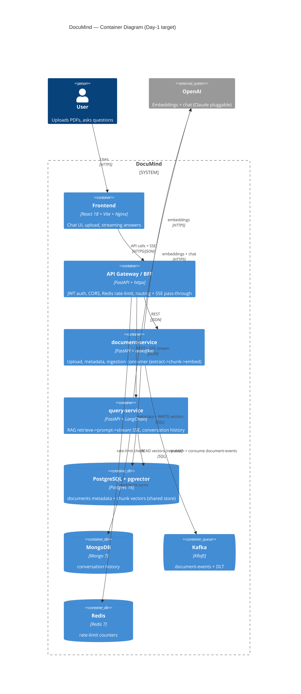

# DocuMind — Architecture (C4 Container view)

DocuMind is a RAG document Q&A app: upload PDFs, ask questions, get a grounded,
streamed answer with `[filename, chunk N]` citations.

## Container diagram

## The two request flows

**Upload & ingestion (async).** Browser → gateway → document-service stores the
PDF, writes an `UPLOADED` row, and publishes `document.uploaded`. The ingestion
consumer (inside document-service) extracts → chunks → embeds → writes vectors to
pgvector → marks `READY`. Failures retry 3× then land on the DLT as `FAILED`.

**Ask (sync, streamed).** Browser → gateway (JWT + rate-limit) → query-service
embeds the question, does a top-k cosine search in pgvector, builds a grounded
prompt, and **streams** the answer back as SSE — passed through the gateway
unbuffered — then persists the turn to MongoDB.

## Service responsibilities

| Service | Owns | Talks to |
|---|---|---|
| **gateway** | `users` table, JWT, rate-limit counters | document-service, query-service, Redis |
| **document-service** | `documents` table, file storage, ingestion | Postgres, Kafka, pgvector (write), OpenAI |
| **query-service** | `conversation_turns` | Postgres/pgvector (read), MongoDB, OpenAI |

## Shared building blocks

- **`libs/documind_contracts`** — Pydantic events + DTOs (the wire contract).
- **`libs/documind_common`** — providers + pgvector access + the embedding
  config that the writer and reader must agree on.

See [`../adr/0001-microservices-split.md`](../adr/0001-microservices-split.md)
for why the split looks like this and the trade-offs we accepted.
